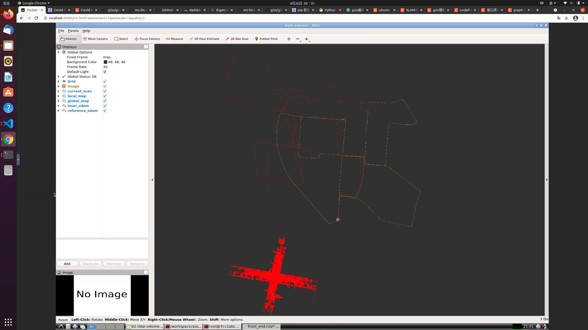
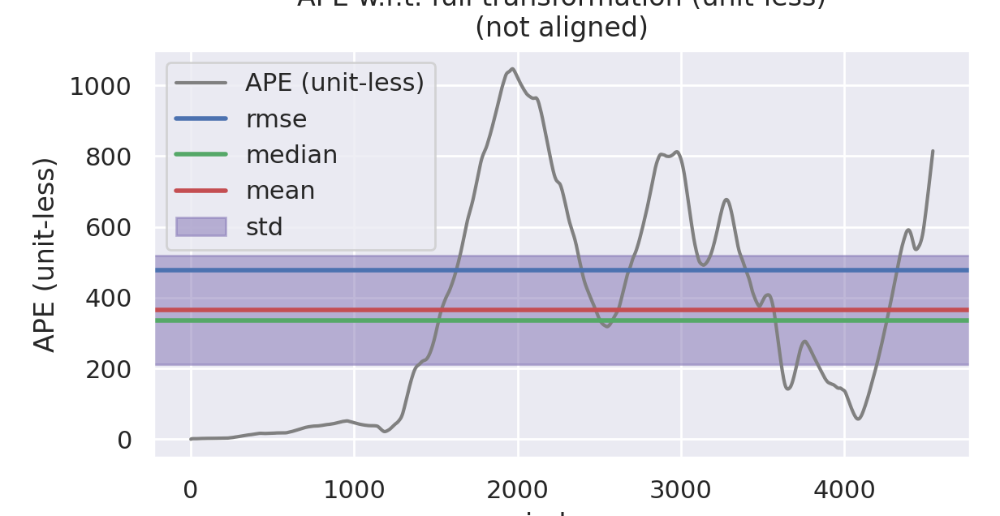
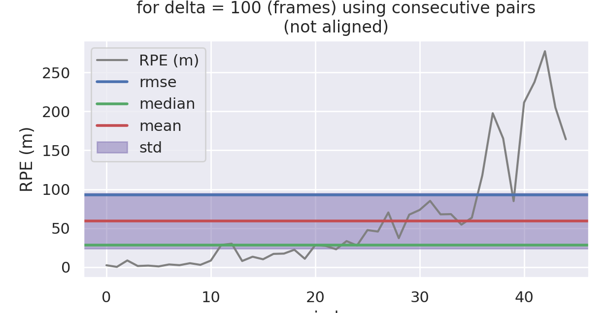
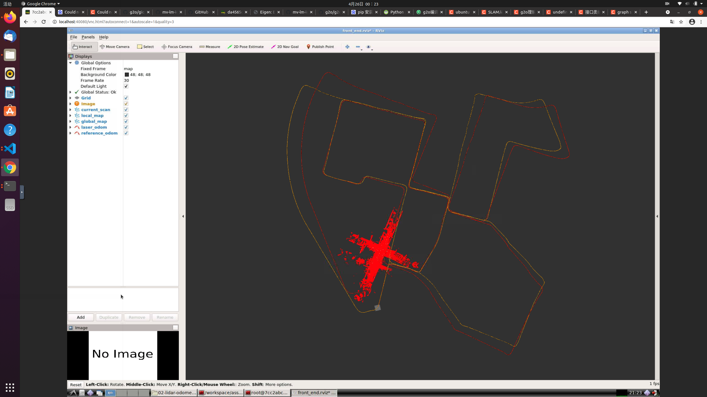
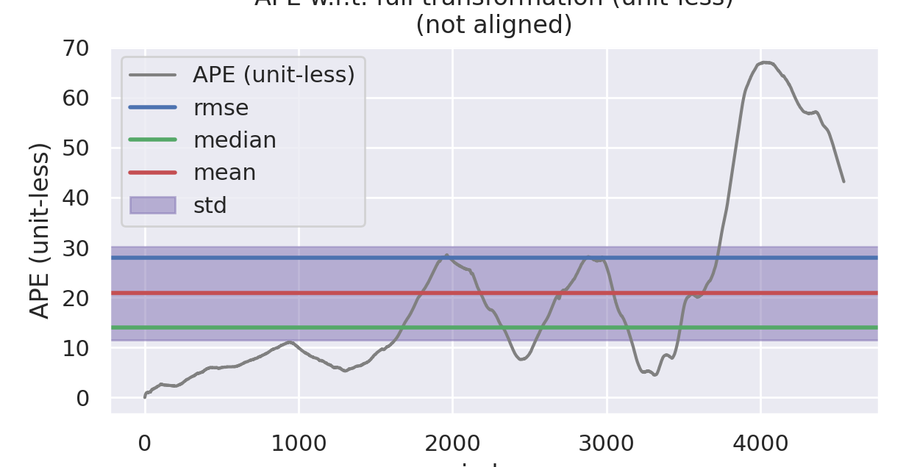
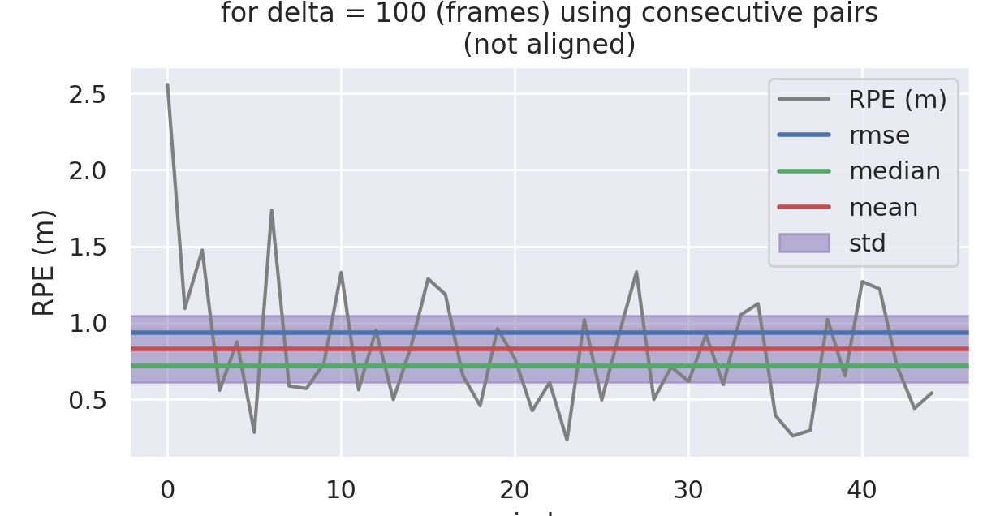
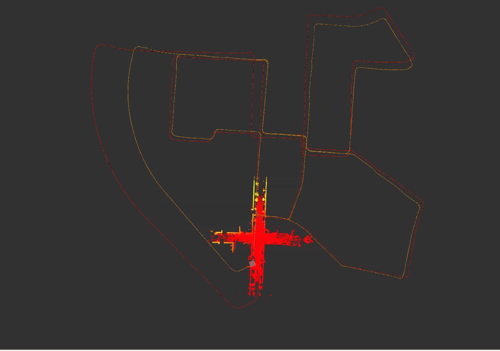

# 3D激光里程计I

## 作业主要完成的部分 

本次作业主要在代码框架下完成了以下几个部分:

* 补全了代码框架中的SICP部分
* 补全了代码框架中的ICP-SVD部分
* 自己实现了基于优化的 ICP 匹配，并保持了接口的一致性，可以通过 配置文件更改方法和参数，基于优化的 ICP 与 ICP 和 ICP-SVD 的参 数保持了一致性

## evo评价

主要选择了ICP，NDT以及自己实现的基于优化的ICP方法，使用evo对结果进行评价，结果如下：

### ICP

### NDT

### ICP-优化

> 注意，这里基于优化的ICP没有进行旋转矩阵的归一化，具体的归一化代码可以参考ICP-SVD部分，后期会对代码进行重构
