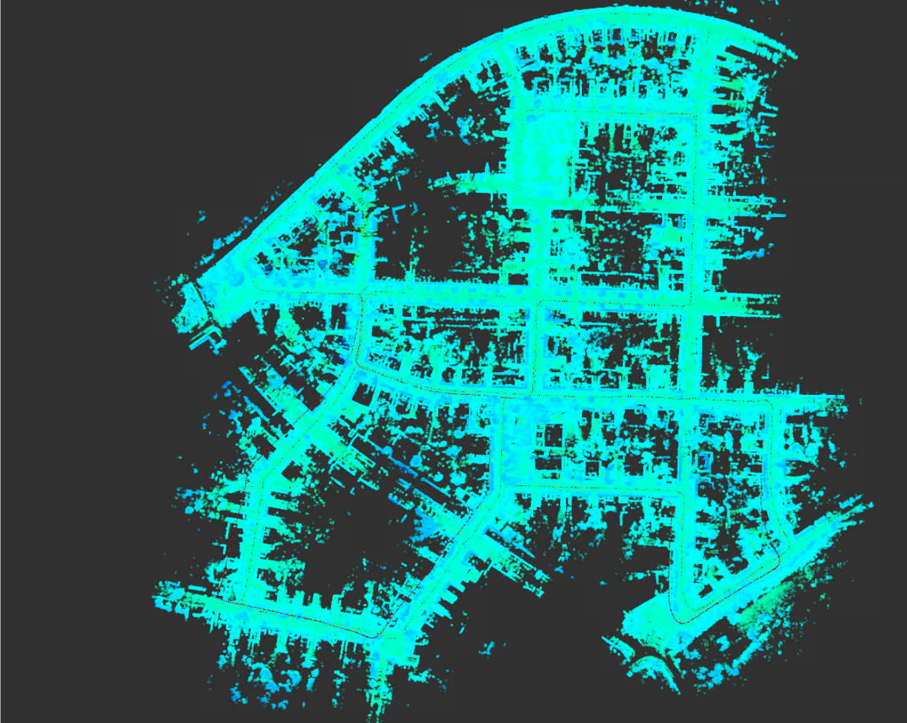
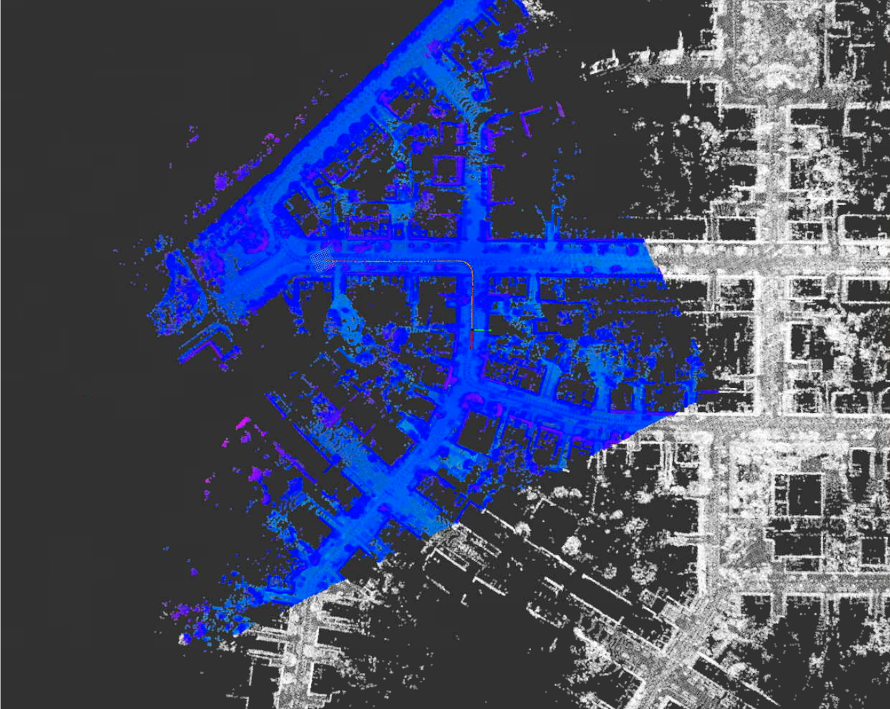
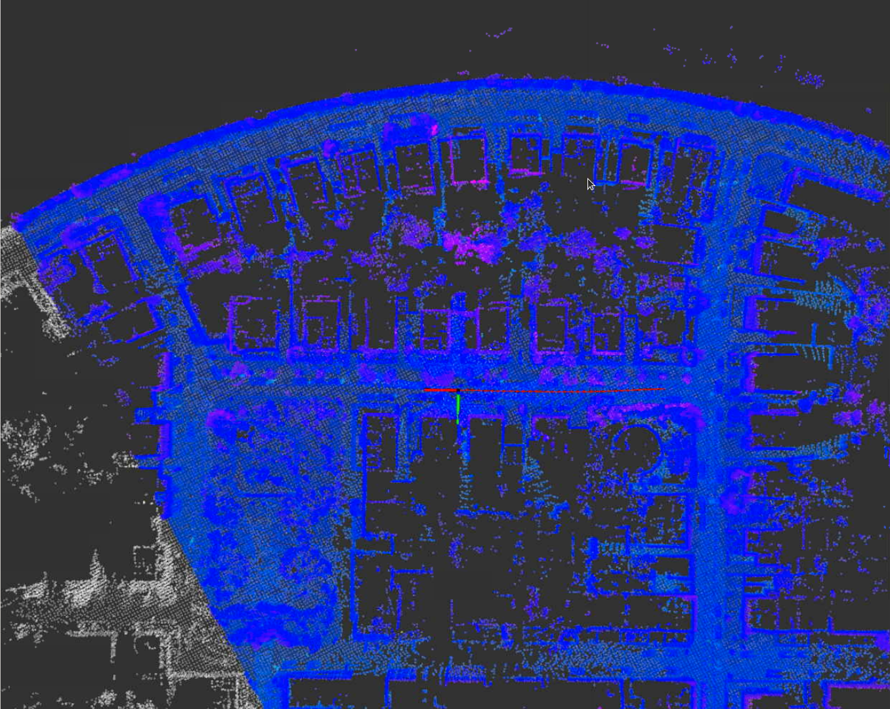
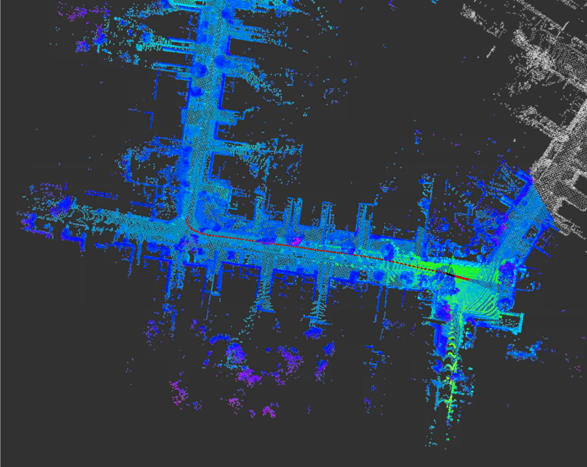
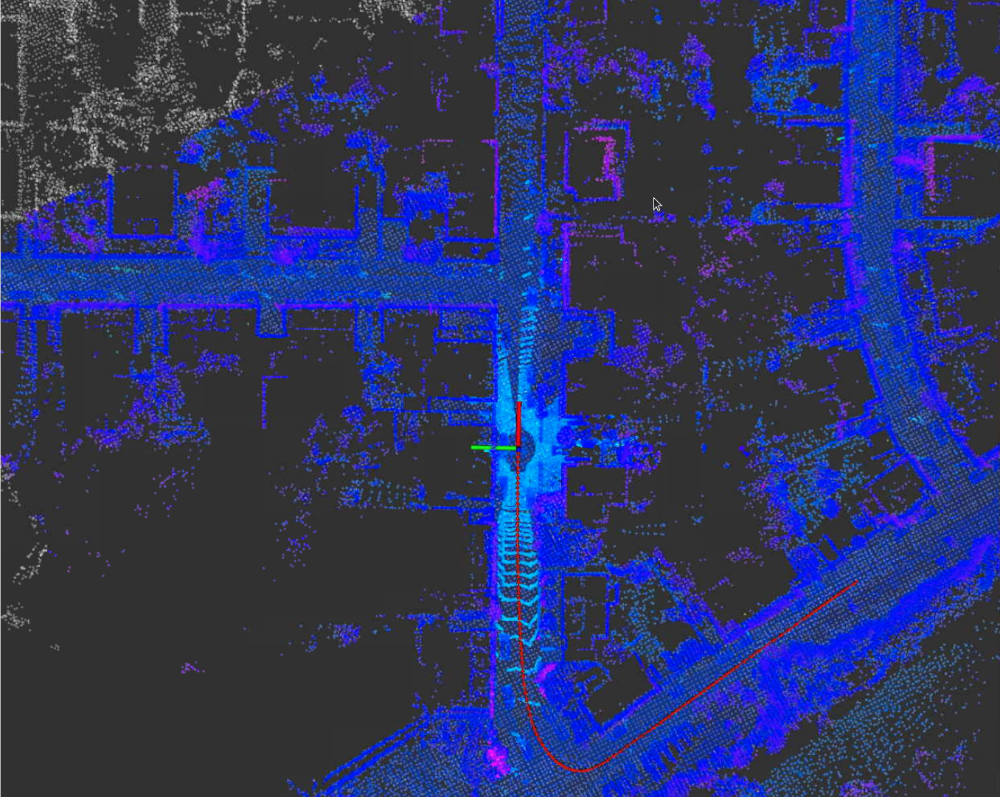
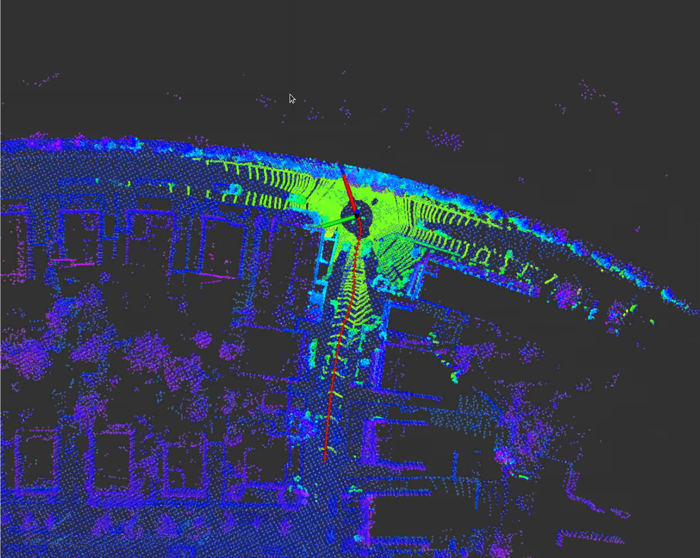

# 第四章作业

## 1.跑通建图流程



## 2.实现在任意位置的初始化

选择使用两种方法进行初始化，首先尝试使用`Scan Context`的方法确定初始位置，如果失败后，则选择使用当前的`GNSS`位置作为初始位置，代码如下：

```c++
bool MatchingFlow::UpdateMatching() {
    if (!matching_ptr_->HasInited()) {
        //
        // TODO: implement global initialization here
        //
        // Hints: You can use SetGNSSPose & SetScanContextPose from matching.hpp
        //
        if(matching_ptr_->SetScanContextPose(current_cloud_data_)) {
            LOG(INFO) << "Scan Context Localization Init Succeeded !" << std::endl;
        }
        else{
            matching_ptr_->SetGNSSPose(current_gnss_data_.pose);
            LOG(INFO) << "GNSS Init Succeeded !" << std::endl;
        }
    }

    return matching_ptr_->Update(current_cloud_data_, laser_odometry_);
}
```

效果如下：

1. 原点初始化

   

2. 100s初始化

   

3. 200s初始化

   

4. 300s初始化

   

5. 400s初始化

   

