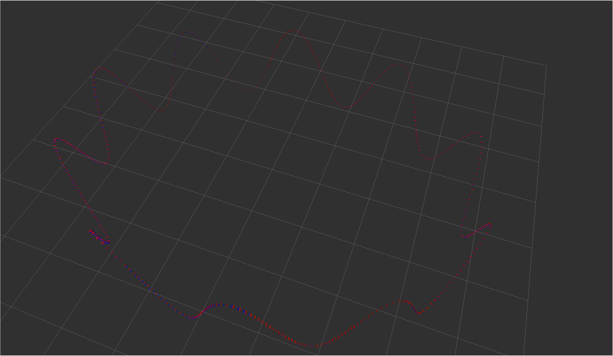
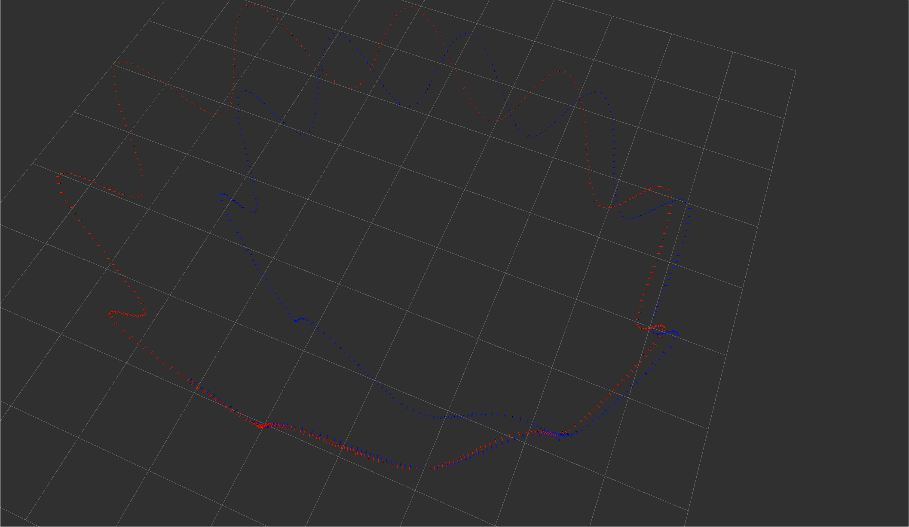
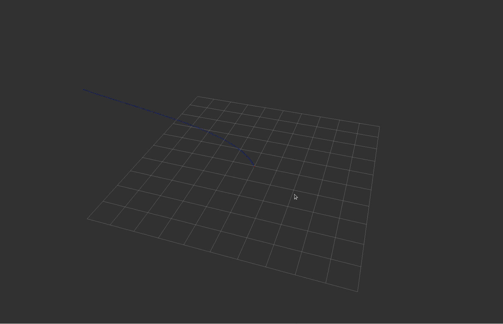
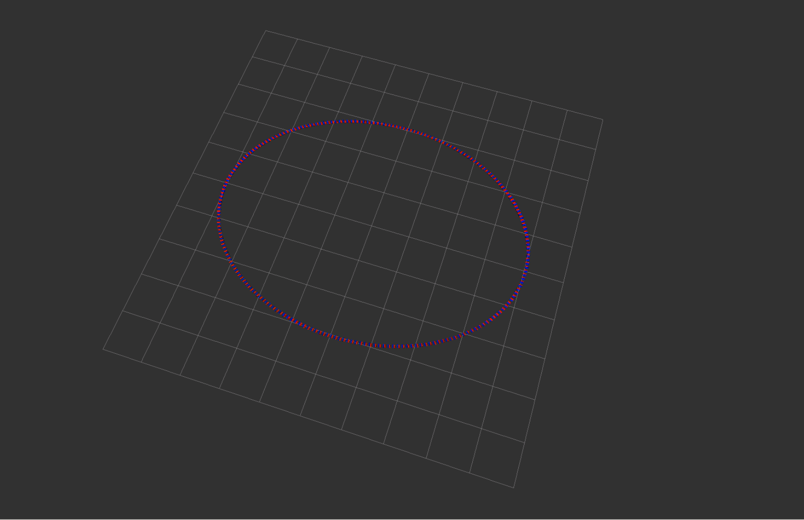
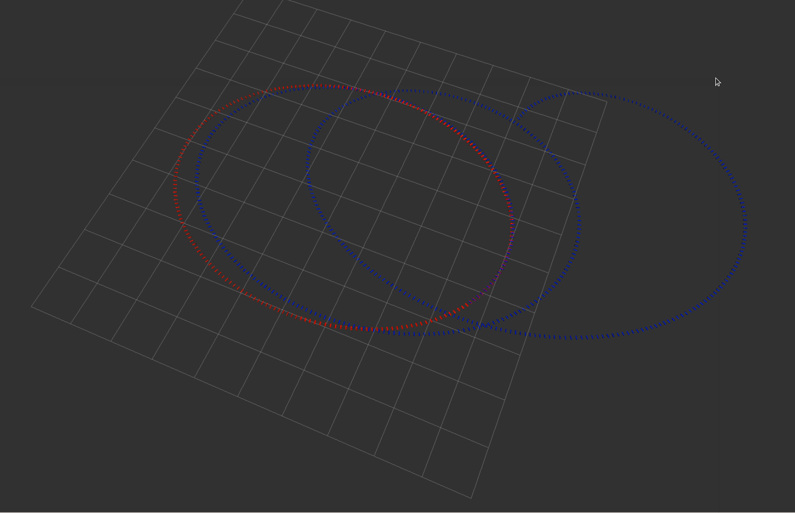
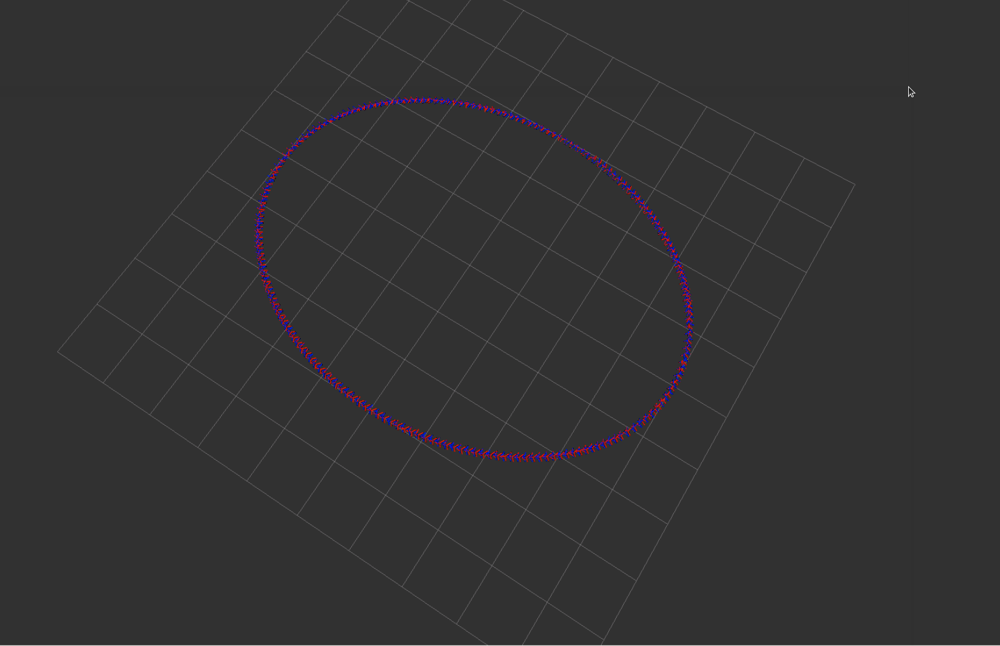
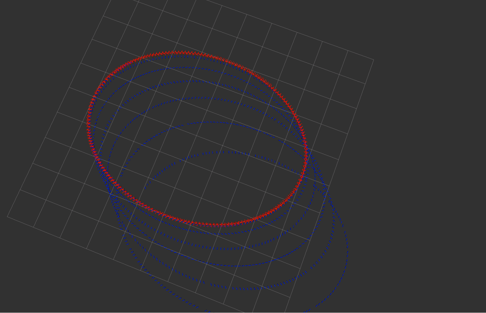

# 第六章作业

## 根据课程给定的数据，完成基于中值法的解算;

根据课程框架的提示，补全基于中值法的解算，代码如下:

```c++
bool Activity::UpdatePose(void) {
    if (!initialized_) {
        // 使用最近一次的里程计进行初始化:
        OdomData &odom_data = odom_data_buff_.back();
        IMUData imu_data = imu_data_buff_.back();

        pose_ = odom_data.pose;
        vel_ = odom_data.vel;

        initialized_ = true;

        odom_data_buff_.clear();
        imu_data_buff_.clear();

        // keep the latest IMU measurement for mid-value integration:
        imu_data_buff_.push_back(imu_data);
    } else {
        // 获取角度:
        Eigen::Vector3d angular_delta; 

        GetAngularDelta(1, 0, angular_delta);

        // 更新旋转:
        Eigen::Matrix3d R_curr, R_prev;
        UpdateOrientation(angular_delta, R_curr, R_prev);

        // 获取速度信息:
        double delta_t;
        Eigen::Vector3d velocity_delta;
        GetVelocityDelta(1, 0, R_curr, R_prev, delta_t, velocity_delta);

        // 更新位置:
        UpdatePosition(delta_t, velocity_delta);

        // 移除最早的数据:
        imu_data_buff_.pop_front();

    }
    
    return true;
}
```

结果如下:


## 根据课程给定的数据，完成基于中值法、欧拉法的解算，并对精度做对比分析

将中值法改为欧拉法，主要修改地方如下

```c++
    //angular_delta = 0.5*delta_t*(angular_vel_curr + angular_vel_prev);
    angular_delta = delta_t*angular_vel_prev;

    //velocity_delta = 0.5*delta_t*(linear_acc_curr + linear_acc_prev);
    velocity_delta = delta_t* linear_acc_prev;
```

将中值法与欧拉法进行对比，结果如下:

|       中值法        |       欧拉法        |
| :-----------------: | :-----------------: |
|  |  |

从图中可以明显看出，随着时间的增加，欧拉法的累积误差的增加速度远远大于中值法，也证明了在课程数据的运动模式和IMU采样频率下，中值法有着良好的精度。

## 利用IMU仿真程序，自己生成不同运动状况(静止、匀速、加减速、快速转弯等)的仿真数 据，对比两种解算方法精度差异与运动状况的关系，并给出原因分析

由于`gnss-ins-sim`缺乏真值并且对于运动的方便理解但是修改实现起来不够直接，选择使用基于原始框架的修改来对比不同运动状况下两种方法的精度差异，主要的修改参数为$\omega_{xy},\omega_{z}$

### 静止

|           中值法            |       欧拉法        |
| :-------------------------: | :-----------------: |
|  |  |

### 匀速运动

|       中值法        |       欧拉法        |
| :-----------------: | :-----------------: |
|  |  |

### 快速运动

|       中值法        |       欧拉法        |
| :-----------------: | :-----------------: |
|  |  |

根据上述带噪声静止情况下以及无噪声运动状况下和原始代码运动情况下两种方法的对比可知：对于惯性解算来说，中值法的精度会显著高于欧拉法，并且运动越剧烈，精度差异越大，这主要是由数值积分算法的精度引起的，对于数值积分算法来说，对于积分曲线的的局部拟合越精确，积分结果就越准确。欧拉法使用左端点的导数代替区间内的导数，而中值法使用两个端点的导数的均值代替区间内的导数，当运动剧烈时，区间内的导数与左端点的导数相差较大，欧拉法积分结果误差比较大，而对于中值法来说，由于运动的连续性及测量元件的高频性，左右端点均值的积分与区间内的逐点积分结果相差比欧拉法要小，结果要更加精确。当然，还可以选择更高精度的数值积分方法，比如`四阶龙格库塔法`等，但是出于计算复杂性和精度的综合考量，在高频测量单元的情况下，中值法不失为一个惯性解算的良好方法。

