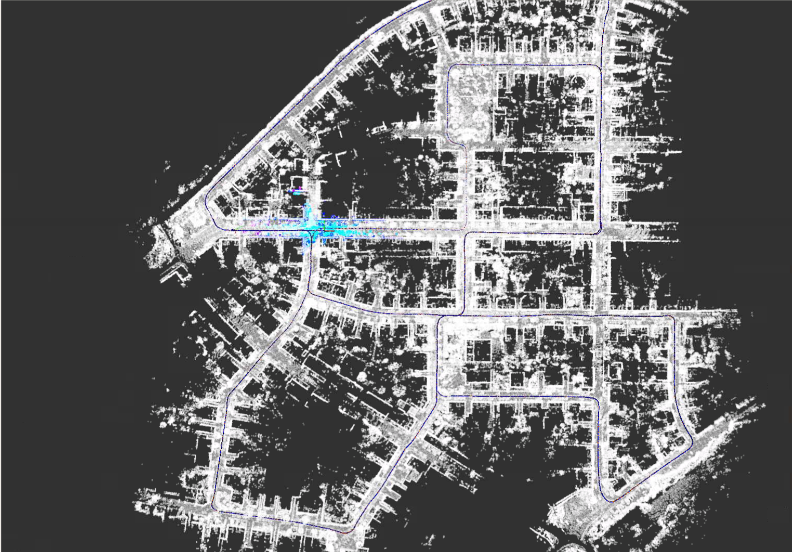
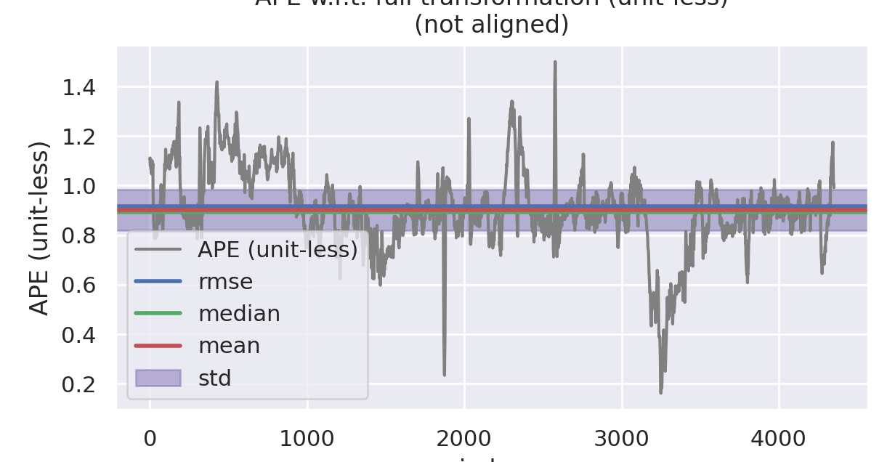
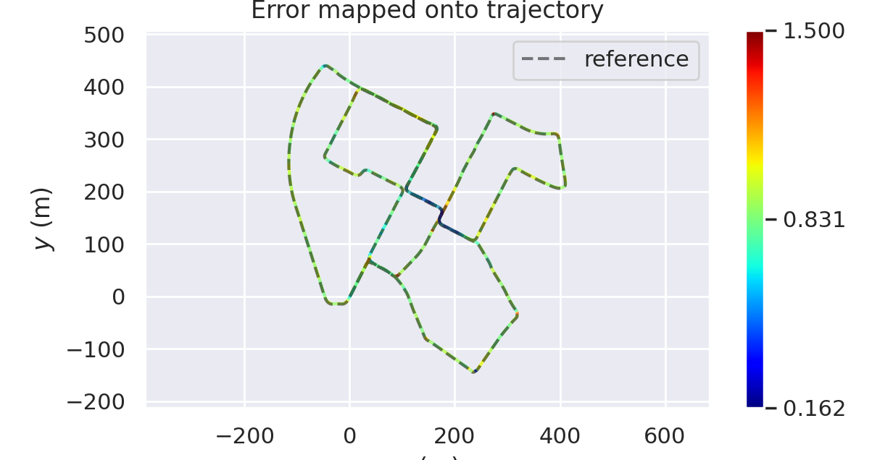
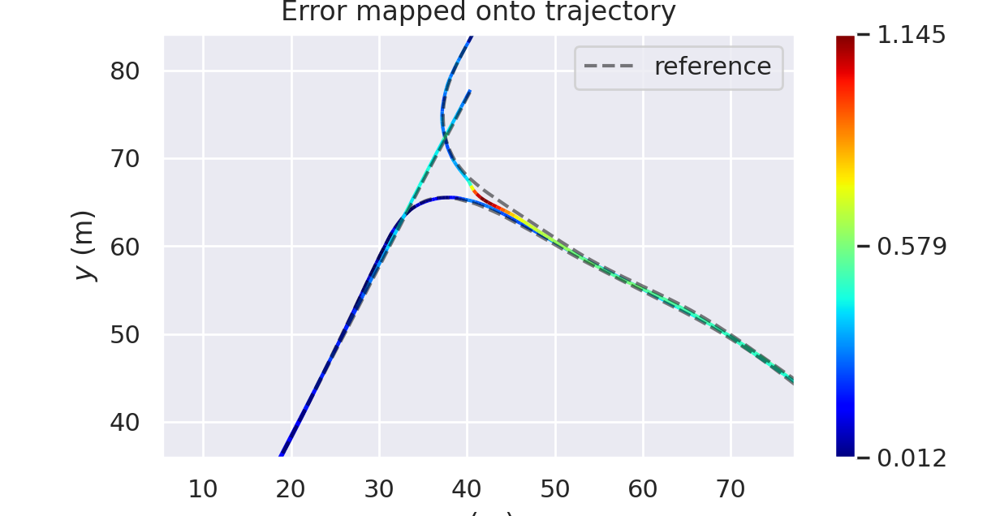
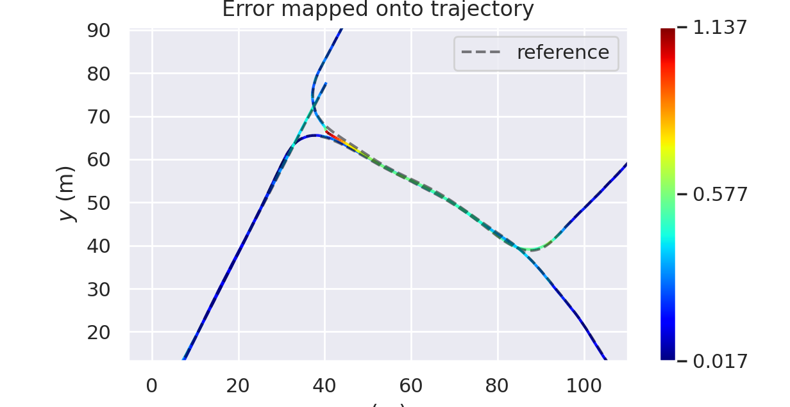

# 第七章作业

## 补全代码，且滤波功能正常

根据ppt中的公式和代码中的提示，补全了ESKF的框架，并可以正常编译和运行



## 补全代码，功能正常，且经过调试参数，滤波后性能比滤波前好

使用evo评价工具进行对比

### 滤波前

|  |  |
| --------------------------------- | --------------------------------- |

```bash
APE w.r.t. full transformation (unit-less)
(not aligned)

       max	1.500344
      mean	0.901765
    median	0.893769
       min	0.161967
      rmse	0.916786
       sse	3657.841542
       std	0.165277
```

### 滤波后

|  |  |
| --------------------------------- | --------------------------------- |

```bash
APE w.r.t. full transformation (unit-less)
(not aligned)

       max	1.521982
      mean	0.897535
    median	0.894192
       min	0.058380
      rmse	0.913938
       sse	3635.146581
       std	0.172374
```

从上述数据可以看出，滤波后误差的均值有所下降，同时对比滤波前后开始段的轨迹

| 滤波前              | 滤波后              |
| ------------------- | ------------------- |
|  |  |

可以看出在开始段滤波后的轨迹比滤波前更加接近真值。

## 不考虑随机游走模型时的推导过程

$$
\delta \dot{x}=F_t \delta x+B_tw
$$

其中主要改变的为B矩阵
$$
\boldsymbol B_t =
\begin{bmatrix}
0 & 0  \\
\boldsymbol R_t &0 \\
0 & \boldsymbol I_3 \\
0 & 0  \\
0 & 0 
\end{bmatrix}
$$
离散情况下
$$
\boldsymbol B_{k-1} =
\begin{bmatrix}
0 & 0  \\
\boldsymbol R_{k-1}T &0 \\
0 & \boldsymbol I_3T \\
0 & 0  \\
0 & 0 
\end{bmatrix}
$$
对应的噪声项
$$
w = \begin{bmatrix} n_a \\ n_{\omega} \end{bmatrix}
$$
事实上，在实现中，只需要将`bais`更新代码注释掉，不对其进行更新即可。

## 不同噪声设置情况下的结果对比(至少5组参数)

### 参数1

```bash
    covariance:
        prior:
            pos: 1.0e-5
            vel: 1.0e-5
            ori: 1.0e-5
            epsilon: 1.0e-6
            delta: 1.0e-6
        process:
            gyro_noise: 1.0e-5
            accel_noise: 2.5e-5
            gyro_walk: 1.0e-5
            accel_walk: 2.5e-5
        measurement:
            pose:
                pos: 2.0e-1
                ori: 2.0e-1
            pos: 1.0e-4
            vel: 2.5e-3
```

滤波前

```bash
   max	1.136680
  mean	0.231142
median	0.163627
   min	0.017465
  rmse	0.289274
   sse	366.600726
   std	0.173934
```

滤波后

```bash
   max	1.789425
  mean	0.316181
median	0.248966
   min	0.026810
  rmse	0.387849
   sse	659.019287
   std	0.224624
```

### 参数2

```bash
    covariance:
        prior:
            pos: 1.0e-5
            vel: 1.0e-5
            ori: 1.0e-5
            epsilon: 1.0e-6
            delta: 1.0e-6
        process:
            gyro_noise: 1.0e-5
            accel_noise: 2.5e-5
            gyro_walk: 1.0e-5
            accel_walk: 2.5e-5
        measurement:
            pose:
                pos: 2.0e-3
                ori: 2.0e-1
            pos: 1.0e-4
            vel: 2.5e-3
```

滤波前

```bash
   max	1.136680
  mean	0.231931
median	0.164036
   min	0.017465
  rmse	0.290173
   sse	366.691964
   std	0.174380
```

滤波后

```bash
   max	1.131317
  mean	0.278159
median	0.225524
   min	0.029205
  rmse	0.330322
   sse	475.185780
   std	0.178158
```

### 参数3

```bash
    covariance:
        prior:
            pos: 1.0e-5
            vel: 1.0e-5
            ori: 1.0e-5
            epsilon: 1.0e-6
            delta: 1.0e-6
        process:
            gyro_noise: 1.0e-5
            accel_noise: 2.5e-5
            gyro_walk: 1.0e-5
            accel_walk: 2.5e-5
        measurement:
            pose:
                pos: 1.0e-4
                ori: 1.0e-2
            pos: 1.0e-4
            vel: 2.5e-3
```

滤波前

```bash
   max	1.136680
  mean	0.231342
median	0.163955
   min	0.017465
  rmse	0.289456
   sse	365.972245
   std	0.173971
```

滤波后

```bash
   max	1.194392
  mean	0.258817
median	0.198141
   min	0.029705
  rmse	0.310314
   sse	420.615034
   std	0.171197
```

### 参数4

```bash
    covariance:
        prior:
            pos: 1.0e-5
            vel: 1.0e-5
            ori: 1.0e-5
            epsilon: 1.0e-6
            delta: 1.0e-6
        process:
            gyro_noise: 1.0e-6
            accel_noise: 1.0e-5
            gyro_walk: 1.0e-5
            accel_walk: 2.5e-4
        measurement:
            pose:
                pos: 1.0e-6
                ori: 1.0e-6
            pos: 1.0e-4
            vel: 2.5e-3
```

滤波前

```bash
   max	1.136680
  mean	0.231342
median	0.163955
   min	0.017465
  rmse	0.289456
   sse	365.972245
   std	0.173971
```

滤波后

```bash
   max	1.145750
  mean	0.243301
median	0.182558
   min	0.015522
  rmse	0.297851
   sse	388.483635
   std	0.171814
```

### 参数5

```bash
    covariance:
 		prior:
            pos: 1.0e-6
            vel: 1.0e-6
            ori: 1.0e-6
            epsilon: 1.0e-6
            delta: 1.0e-6
        process:
            gyro_noise: 2.5e-2
            accel_noise: 1.0e-2
            gyro_walk: 1.0e-4
            accel_walk: 1.0e-3
        measurement:
            pose:
                pos: 1.0e-6
                ori: 1.0e-6
            pos: 1.0e-4
            vel: 2.5e-3
```

滤波前

```bash
   max	1.136680
  mean	0.231342
median	0.163955
   min	0.017465
  rmse	0.289456
   sse	365.972245
   std	0.173971
```

滤波后

```bash
   max	1.164980
  mean	0.234870
median	0.168759
   min	0.017150
  rmse	0.291701
   sse	373.116764
   std	0.172989
```

