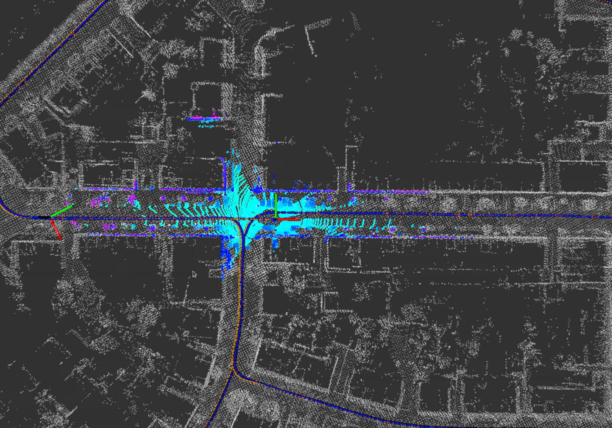
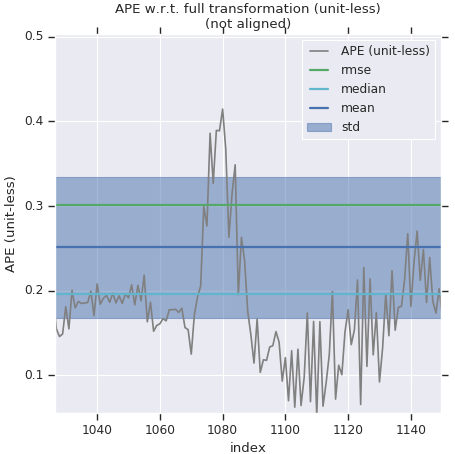
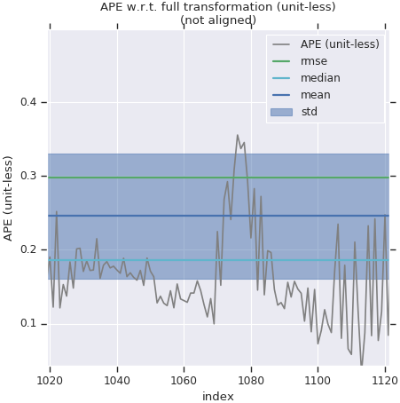
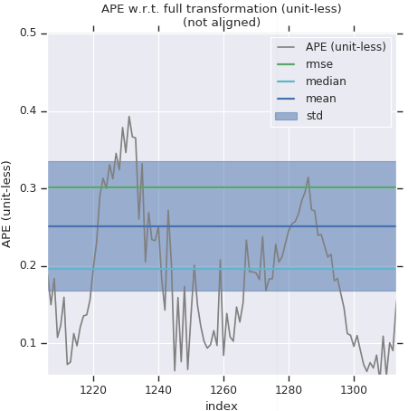
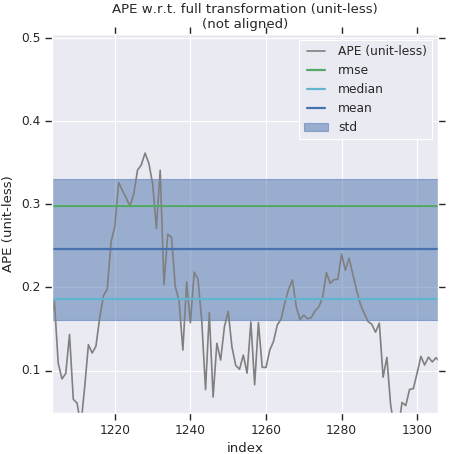
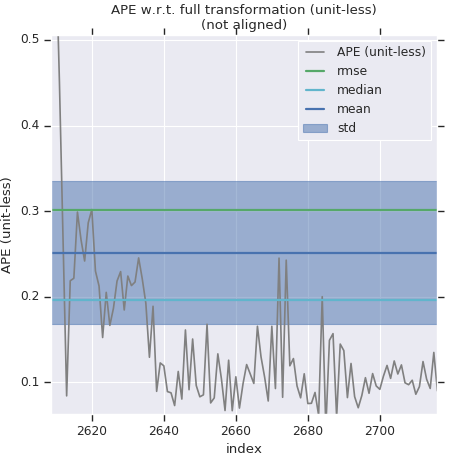
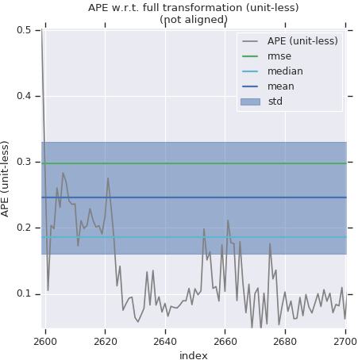

# 第八章作业

## 及格要求: 实现新模型,且功能正常

补全了运动模型融合的代码，具体效果如下



## 实现新模型,且部分路段性能有改善

增加运动模型约束前

```
APE w.r.t. full transformation (unit-less)
(not aligned)

       max	1.093954
      mean	0.251182
    median	0.195883
       min	0.020161
      rmse	0.301639
       sse	399.883827
       std	0.167014
```

增加运动模型约束后

```
APE w.r.t. full transformation (unit-less)
(not aligned)

       max	1.089452
      mean	0.240138
    median	0.182159
       min	0.014682
      rmse	0.295076
       sse	381.801109
       std	0.171474
```

对比部分路段

| 融合运动模型前      | 融合运动模型后      |
| ------------------- | ------------------- |
|  |  |
|  |  |
|  |  |

对比融合运动模型前后的速度曲线(其中绿色为未添加运动模型前，红色为添加运动模型后)

| $v_x$ |   |
| ----- | -------------------- |
| $v_y$ |   |
| $v_z$ |  |

根据以上对比结果可知，添加了运动模型后，整体效果有了轻微的改善，但是速度的波动得到了大幅度的抑制。

## 使用GNSS-Sim的仿真数据,实现以gps位置和编码器速度为观测量的融合方法,并分析其精度

使用`gnss-ins-sim`生成仿真数据如下

```bash
path:        virtual_proving_ground.bag
version:     2.0
duration:    2:35s (155s)
start:       Jun 23 2021 13:06:48.50 (1624453608.50)
end:         Jun 23 2021 13:09:24.50 (1624453764.50)
size:        105.4 MB
messages:    374401
compression: none [135/135 chunks]
types:       geometry_msgs/TwistStamped [98d34b0043a2093cf9d9345ab6eef12e]
             nav_msgs/Odometry          [cd5e73d190d741a2f92e81eda573aca7]
             sensor_msgs/Imu            [6a62c6daae103f4ff57a132d6f95cec2]
             sensor_msgs/MagneticField  [2f3b0b43eed0c9501de0fa3ff89a45aa]
             sensor_msgs/NavSatFix      [2d3a8cd499b9b4a0249fb98fd05cfa48]
topics:      /init_pose                1 msg     : nav_msgs/Odometry         
             /reference_pose       62400 msgs    : nav_msgs/Odometry         
             /sim/sensor/gps/fix   62400 msgs    : sensor_msgs/NavSatFix     
             /sim/sensor/gps/vel   62400 msgs    : geometry_msgs/TwistStamped
             /sim/sensor/imu       62400 msgs    : sensor_msgs/Imu           
             /sim/sensor/imu/mag   62400 msgs    : sensor_msgs/MagneticField 
             /sim/sensor/odo       62400 msgs    : geometry_msgs/TwistStamped
```

仿真结果如下:


融合轨迹误差

```bash
       max	0.889535
      mean	0.187412
    median	0.183697
       min	0.023407
      rmse	0.218405
       sse	74.365630
       std	0.112150
```

gnss误差

```bash
       max	2.842398
      mean	2.096743
    median	2.148564
       min	0.036520
      rmse	2.280333
       sse	8096.273791
       std	0.896431
```

三方向速度

| $v_x$ |  |
| ----- | -------------------- |
| $v_y$ |  |
| $v_z$ |  |

`gnss-编码器`融合矫正大幅度提高了`imu`积分的精度，同时相比于纯`gnss`定位来说，精度和平滑度有了显著的提升